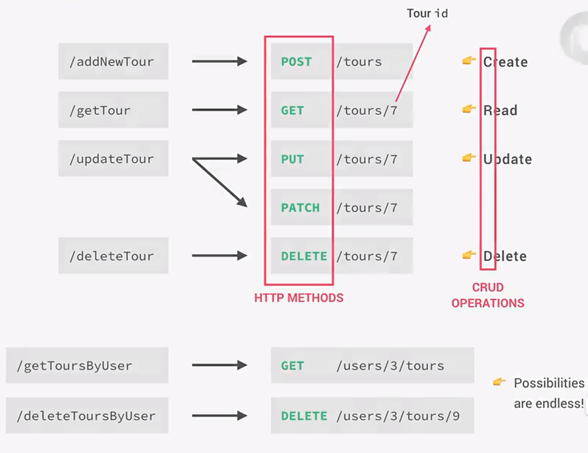

## 048 What is Express_
## 049 Installing Postman
## 050 Setting up Express and Basic Routing
## 051 APIs and RESTful API Design
### API
Application Programming Interface: a piece of software that can be used by another piece of software, in order to allow applications to talk to each other.
### REST
Representational States Transfer
### THE REST ARCHITECTURE
1. Separate API into logical resources
2. Expose structured, resource-based URLs
3. Use HTTP methods(verbs)
4. Send data as JSON(usually)
5. Be Stateless


## 052 Starting Our API_ Handling GET Requests
## 053 Handling POST Requests
```javascript
app.post('/api/v1/tours', (req, res) => {
  const newID = tours[tours.length - 1].id + 1;
  const newTour = Object.assign({ id: newID}, req.body);

  tours.push(newTour);
  fs.writeFile(`${__dirname}/dev-data/data/tours-simple.json`, JSON.stringify(tours), err => {
    if (err) return console.log(err);
    res.status(201).json({
      status: 'success',
      data: {
        tour: newTour
      }
    });
  });
});
```
## 054 Responding to URL Parameters
```javascript
app.get('/api/v1/tours/:id', (req, res) => {
  console.log(req.params);
  const id = req.params.id * 1;
  const tour = tours.find(el => el.id === id);

  if (!tour) {
    return res.status(404).json({
      status: 'fail',
      message: "Invalid ID"
    });
  }

  res.status(200).json({
    status: 'success',
    data: {
      tour
    }
  });
});
```
## 055 Handling PATCH Requests
```javascript
app.patch('/api/v1/tours/:id', (req, res) => {
  if (req.params.id * 1 > tours.length) {
    return res.status(404).json({
      status: 'fail',
      message: 'Invalid ID'
    });
  }

  res.status(200).json({
    status: 'success',
    data: {
      tour: '<Updated tour here...>'
    }
  });
});
```
## 056 Handling DELETE Requests
```javascript
app.delete('/api/v1/tours/:id', (req, res) => {
  if (req.params.id * 1 > tours.length) {
    return res.status(404).json({
      status: 'fail',
      message: 'Invalid ID'
    });
  }

  res.status(204).json({
    status: 'success',
    data: null
  });
});
```
## 057 Refactoring Our Routes
```javascript
const getAllTours = (req, res) => {
  res.status(200).json({
    status: 'success',
    results: tours.length,
    data: {
      tours
    }
  });
};

const createTour = (req, res) => {
  const newID = tours[tours.length - 1].id + 1;
  const newTour = Object.assign({ id: newID}, req.body);

  tours.push(newTour);
  fs.writeFile(`${__dirname}/dev-data/data/tours-simple.json`, JSON.stringify(tours), err => {
    if (err) return console.log(err);
    res.status(201).json({
      status: 'success',
      data: {
        tour: newTour
      }
    });
  });
};

const getTour = (req, res) => {
  console.log(req.params);
  const id = req.params.id * 1;
  const tour = tours.find(el => el.id === id);

  if (!tour) {
    return res.status(404).json({
      status: 'fail',
      message: "Invalid ID"
    });
  }

  res.status(200).json({
    status: 'success',
    data: {
      tour
    }
  });
};

const updateTour = (req, res) => {
  if (req.params.id * 1 > tours.length) {
    return res.status(404).json({
      status: 'fail',
      message: 'Invalid ID'
    });
  }

  res.status(200).json({
    status: 'success',
    data: {
      tour: '<Updated tour here...>'
    }
  });
};

const deleteTour = (req, res) => {
  if (req.params.id * 1 > tours.length) {
    return res.status(404).json({
      status: 'fail',
      message: 'Invalid ID'
    });
  }

  res.status(204).json({
    status: 'success',
    data: null
  });
};

app
  .route('/api/v1/tours')
  .get(getAllTours)
  .post(createTour);

app
  .route('/api/v1/tours/:id')
  .get(getTour)
  .patch(updateTour)
  .delete(deleteTour);
```
