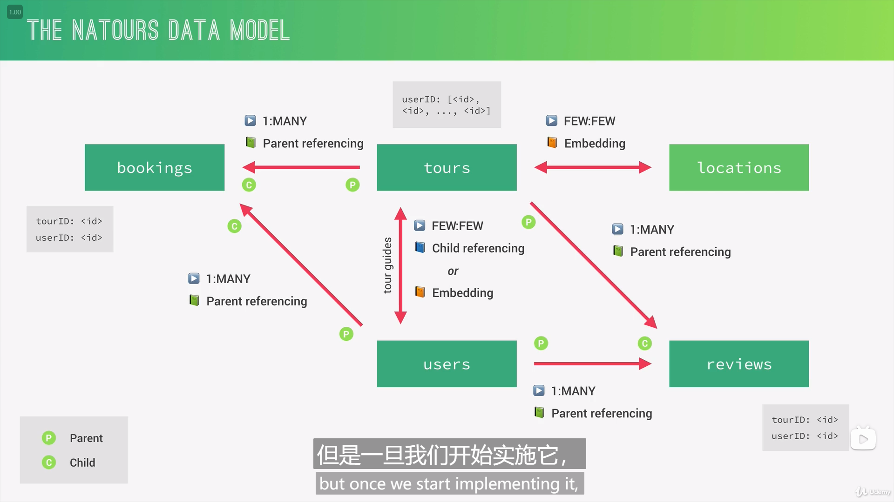

## 124 Modelling User
```javascript
const mongoose = require('mongoose');
const validator = require('validator');

const userSchema = new mongoose.Schema({
  name: {
    type: String,
    required: [true, 'Please tell us your name!'],
  },
  email: {
    type: String,
    required: [true, 'Please provide your email'],
    unique: true,
    lowercase: true,
    validate: [validator.isEmail, 'Please provide a valid email'],
  },
  photo: String,
  password: {
    type: String,
    required: [true, 'Please provide a password'],
    minlength: 8,
  },
  passwordConfirm: {
    type: String,
    required: [true, 'Please confirm your password'],
  },
});

const User = mongoose.model('User', userSchema);

module.exports = User;
```
## 125 Creating New Users
## 129 Logging in Users
## 130 Protecting Tour Routes - Part 1
## 130 Protecting Tour Routes - Part 2
Node.js 内置的 util 模块提供的 promisify 函数用于将老式的Error first callback转换为Promise对象。
## 133 Authorization_ User Roles and Permissions
## 132 Password Reset Functionality_ Reset Token
## 135 Sending Emails with Nodemailer
## 137 Updating the Currect User_ Password
## 138 Updating the Current User_ Data
## 139 Deleting the Current User
## 140 Security Best Practices
## 141 Sending JWT via Cookie
## 144 Data Sanitization
### helmet
helmet 包含一系列的中间件，以增强应用的安全性
### express-mongo-sanitize
该中间件的作用是去除字符串中的 MongoDB 操作符，以防止潜在的攻击。
### xss-clean 
xss-clean 是一个 Node.js 的中间件，用于过滤请求参数中的恶意脚本代码，从而防止 XSS 攻击。
## 145 Preventing Parameter Pollution
### hpp
## 148 Designint Our Data Model

## mongoose 模型中的属性种类
* 基本类型
```javascript
const personSchema = new mongoose.Schema({
  name: String,
  address: {
    street: String,
    city: String,
    state: String,
    zip: String
  }
});
```
* 基本类型数组
```javascript
const personSchema = new mongoose.Schema({
  name: String,
  emails: [String],
  phoneNumbers: [String],
  friends: [Object],
  comments: [{
    type: mongoose.Schema.Types.ObjectId,
    ref: 'Comment'
  }]
});
```
* 对象
```javascript
const personSchema = new mongoose.Schema({
  name: String,
  address: {
    street: String,
    city: String,
    state: String,
    zip: String
  },
  author: {
    type: mongoose.Schema.Types.ObjectId,
    ref: 'User'
  }
});
```
* 任意类型
```javascript
const documentSchema = new mongoose.Schema({
  name: String,
  content: mongoose.Schema.Types.Mixed
});
```
## 149 Modelling Locations(Geospatial Data)
在MongoDB中，每个文档（document）都有一个唯一的ObjectId属性，用于标识该文档。当一个文档的属性是对象数组时，每个对象也被视为一个文档，并且也需要有一个唯一的ObjectId来标识它。

因此，MongoDB在对象数组中的每个对象中都会自动添加一个默认的_id属性，以确保每个对象都有一个唯一的标识符。这个_id属性是由MongoDB自动生成的，可以保证在集合中唯一。如果没有指定_id属性，MongoDB会自动为每个文档生成一个ObjectId。

在实际应用中，可以选择自定义属性来替代MongoDB自动生成的ObjectId。但需要注意的是，为了确保每个对象都有一个唯一的标识符，自定义的属性也需要具备唯一性。
## 151 Modelling Tour Guides_ Child Referencing
## 152 Populating Tour Guides
## 153 Modeling Reviews_ Parent Referencing
## 156 Virtual Populate_ Tours and Reviews
## 163 Adding a _me Endpoint